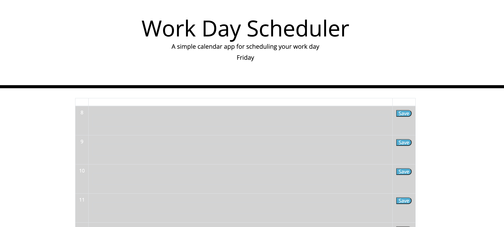

# Work_Day_Schedule_Builder
Building a Daily Planner to add events to.

## Description

The goal with this project was to create a single day scheduler that one could add events to throught the day. The application runs natively in the browser and when save buttons are clicked for the lines, the event in that line are saved even upon page reload. Additionally, the background of the text area for the events updates based on the time of day. Gray being in the past, green is in the future, and red is the current hour.

## Usage

See the deployed application [here](https://tward9.github.io/Work_Day_Schedule_Builder/)

When opened, you should see the below image:

## Credits

Original Code and images came from the [NU Coding Bootcamp Gitlab](https://nu.bootcampcontent.com/NU-Coding-Bootcamp/NU-VIRT-FSF-PT-01-2022-U-LOL)